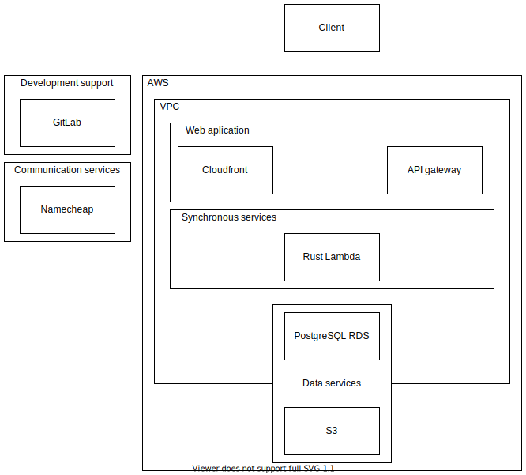

# Mangrove

[See the Demo and learn more about the project.](https://mangrove.reviews)

> Work in progress!

This repository contains:
- [Mangrove Review Standard](ui/content/Mangrove_Review_Standard.md)
- [Mangrove Original Services Terms of Use](ui/content/Mangrove_Original_Services_ToS.md)
- Mangrove Original Server implementation as [Lambda](https://aws.amazon.com/lambda/) using [Rocket](https://rocket.rs/)
  - [Reviewer Lambda](servers/reviewer) accessing PostgreSQL database
  - [File Hoster Lambda](servers/file_hoster) accessing an S3 bucket
- [Mangrove Original UI](ui) implementation
  - Client using Vue.js
- [Mangrove Client JS Library](libraries/mangrove-reviews-js) for interacting with Mangrove Servers
- [Mangrove Aggregator](aggregator) a probabilistic model to help with making sense of reviews

## Architecture



## Local testing

Both servers need to be up for the UI to work.

`yarn` and [Rust compiler](https://rustup.rs/) is needed:

Nightly compiler version is used:
```
rustup default nightly
```

Run the UI:
```
cd ui
yarn install
yarn dev
cd ..
```

### Mangrove Review Server

Server relies on a Postgres database running and set up with [PostGIS](https://postgis.net/install/) and [Diesel](https://diesel.rs/guides/getting-started/):
```
cargo install diesel_cli --features "postgres" --no-default-features
cd servers/reviewer
diesel setup
```

You may also need to install `libssl-dev` (i.e. `sudo apt install libssl-dev`).

Build and run the server.
```
cargo run
```

See [the API docs here](https://docs.mangrove.reviews).

### Mangrove File Server

```
cd servers/file_hoster
cargo run
```

- `/upload`: `PUT` a file to store it on the server, get SHA256 hash of the file if successful.
- `/`: `GET` a file with given base64url encoded SHA256 hash from `/<hash>`.

## Deploying to AWS Lambda

Deployment can be done using AWS CloudFormation using the [Serverless Application Model](https://docs.aws.amazon.com/lambda/latest/dg/serverless_app.html). The required CloudFormation template is already set up in [aws-template.yaml](aws-template.yaml).

Requirements:
- Docker
- [AWS CLI](https://aws.amazon.com/cli/)
- An existing S3 bucket
- `libpq` Lambda Layer

Adjust the name of S3 buckets in the scripts below and run:

```
./servers/file_hoster/deploy.sh
./servers/reviewer/deploy.sh
```

Run the `script` in `.gitlab-ci.yml` making sure to use your own S3 bucket.

### `libpq` Lambda Layer

Deploying the Reviewer Lambda to AWS requires a Lambda Layer containing `libpq`.
We host a [base docker image with this layer included on Docker Hub](https://hub.docker.com/r/plantingspace/lambda-rust).

To deploy your own layer, follow these instructions based on: https://github.com/DrLuke/postgres-libpq-aws-lambda-layer


```
git clone git@github.com:DrLuke/postgres-libpq-aws-lambda-layer.git
cd postgres-libpq-aws-lambda-layer
# Updating the submodule does not work after cloning, so just add it.
git submodule add git://git.postgresql.org/git/postgresql.git postgresql
cd postgresql
# Use the same version as one running on AWS RDS.
git checkout tags/REL_11_5
# Install missing requirements.
sudo apt install bison flex
./configure --without-readline
make
make check
cd ..
./build_layer.sh

```
Then deploy with
```
aws lambda publish-layer-version \
  --layer-name postgres-libpq \
  --zip-file fileb://aws-libpg-layer.zip \
  --compatible-runtimes provided
```
